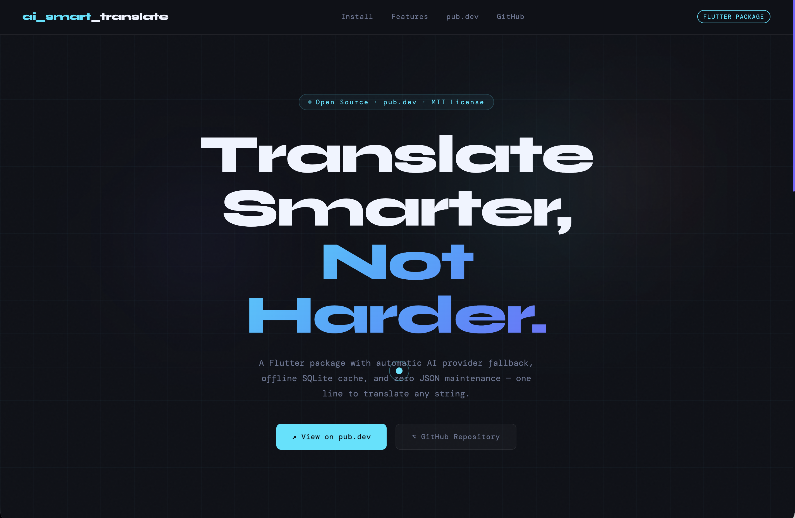

# ai_smart_translate — Website



This is the `site` branch — source for the package website hosted at
**[vishalwork.github.io/ai_smart_translate](https://vishalwork.github.io/ai_smart_translate)**

## Structure

```
index.html   ← single-page website (HTML + CSS + JS, no build step)
```

## Package

- **pub.dev** → [pub.dev/packages/ai_smart_translate](https://pub.dev/packages/ai_smart_translate)
- **Source code** → `main` branch
